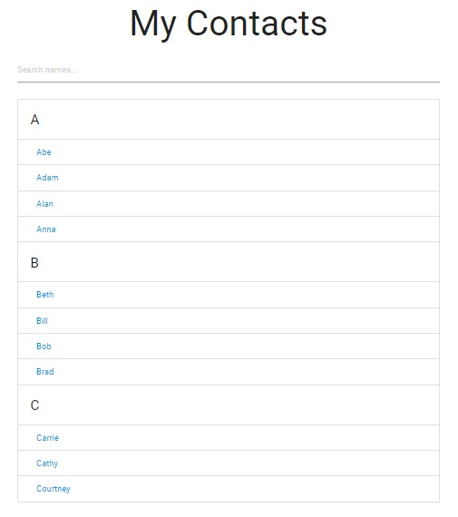

# [Build A Filterable Contact List With Vanilla JavaScript](https://www.youtube.com/watch?v=G1eW3Oi6uoc)

In this project, we have a list of contacts that will be displayed at initial state on page load. As user starts to type into the input field, the list will be filtered that only show results matching the input keyed. We'll learn how to code this using vanilla JavaScript.

[View demo site here.](https://webdevtuts.github.io/filterable_contact_list/)

